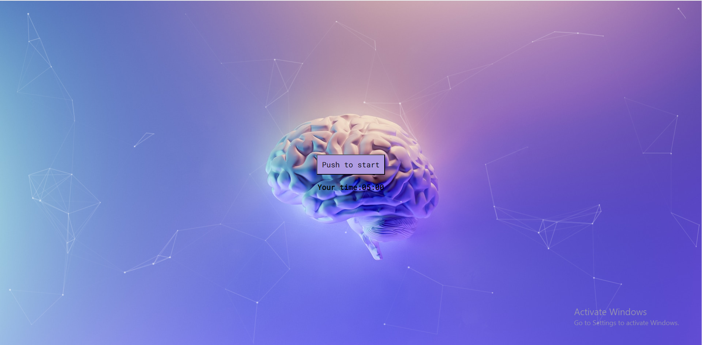

# Interactive Quiz and Timer

Welcome to the Interactive Quiz and Timer! This web application combines a countdown timer and an interactive quiz. Use it to challenge yourself and stay focused.

## Features

- **Countdown Timer:** Set the timer to a specific duration and start it by clicking "Push to start."
- **Quiz Questions:** Answer five math questions to test your knowledge and earn a score.
- **Interactive Background:** Enjoy the dynamic background created with particles.js.

## Getting Started

1. Open the application in your web browser.
2. Click the "Push to start" button to initiate the countdown timer.
3. Answer the quiz questions as quickly as you can.
4. When you're done, click the "Push to finish" button to see your score.

## Technologies Used

This project is built using the following technologies:

- HTML
- CSS
- JavaScript
- Particles.js - for the interactive background.

## Author

- Author: Ekaterina Savoskina
- Contact: savosya23@gmail.com

## Acknowledgments

- The dynamic background is created with particles.js.
- Feel free to customize the quiz questions to suit your preferences and add more features as needed.

Enjoy your interactive quiz and timer!
